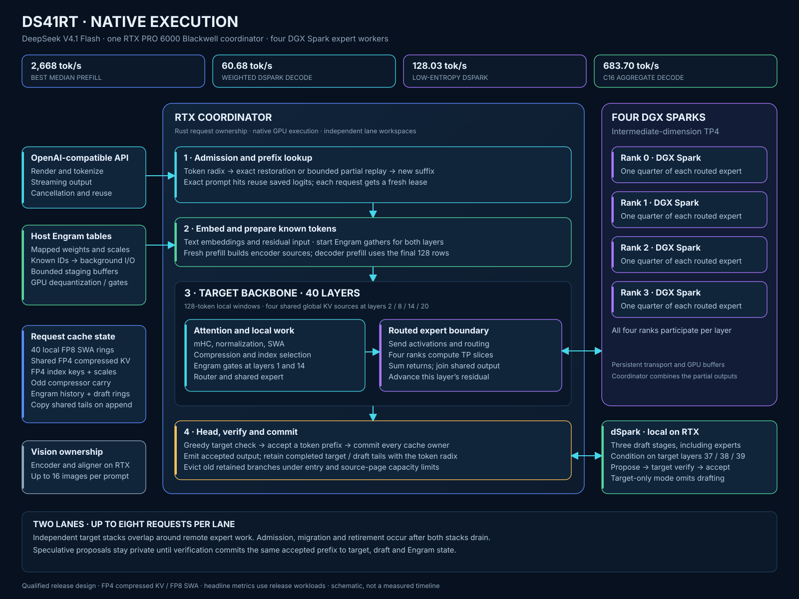

# DS41RT

DS41RT serves the official [DeepSeek V4.1 Flash](https://huggingface.co/deepseek-ai/DeepSeek-V4.1-Flash) checkpoint across one RTX PRO 6000 Blackwell coordinator and four DGX Spark expert workers. It combines native target execution, local dSpark speculative decoding, token-level prefix reuse, tools, constrained output, and vision in one OpenAI-compatible service.

All reported RTX measurements use an enforced **400 W power limit** and **standard 14,001 MHz maximum memory speed with no memory overclock**. The loaded memory clock reached 13,365 MHz; the RTX driver was 595.91.07. The four GB10 workers used driver 580.159.03.

[](docs/native-path-execution.svg)

## Performance

The standard `v2` build uses independent adaptive dSpark lanes, architectural FP4 compressed KV, bottom-up RTX expert placement, and cooperative decode completion. Local target-only and dSpark workloads ran sequentially. Throughput tests use temperature zero and thinking disabled; tool evaluation uses thinking enabled at high effort and C16. Against v1, weighted dSpark decode rose from 70.43 to 79.80 tok/s and aggregate C16 decode rose from 742.91 to 934.05 tok/s.

**Headline results.** Median throughput, the qualified cache and placement policy, memory use, and clean startup.

| Measurement | Result |
|---|---:|
| Best median prefill, 0 base + 32K new (preserved v1) | **7,743.47 tok/s** |
| Low-entropy target-only decode, counting 1–200 warm median | 45.08 tok/s |
| Low-entropy dSpark decode, counting 1–200 warm median | **155.91 tok/s** |
| Weighted eight-type target-only median | 44.29 tok/s |
| Weighted eight-type dSpark median | **79.80 tok/s** |
| dSpark gain on weighted mix | 80.17% |
| C16 aggregate warm decode median | **934.05 tok/s** |
| Standard RTX routed-expert placement | **5 layers (0–4)** |
| Spark expert residency / configured budget | 40 layers per worker / 100 GiB |
| Global FP4 source pool | 16.681 GB for 18,710,016 logical tokens (+32,768 private-tail tokens) |
| Exact prompt / completed-turn retention | 24 / 24 entries |
| Peak observed coordinator GPU memory used | 96,950 MiB |
| Clean build / standard dSpark launch | 304.85 s / 57.76 s |

**Eight content types and counting.** Three local samples per mode. The official Flash column is the preserved one-request v1 reference and was not called again. Counting is outside the weighted score.

| Case | Target tok/s | dSpark tok/s | Official Flash tok/s | Target completed | dSpark completed | Official completed |
|---|---:|---:|---:|---:|---:|---:|
| Code | 44.87 | 126.21 | 345.90 | 3/3 | 3/3 | 1/1 |
| Math | 44.61 | 135.07 | 285.33 | 3/3 | 3/3 | 1/1 |
| Fable | 43.90 | 54.31 | 123.63 | 3/3 | 3/3 | 1/1 |
| Hello | 42.48 | 77.55 | 141.10 | 3/3 | 3/3 | 1/1 |
| Topic | 44.93 | 72.06 | 169.24 | 3/3 | 3/3 | 1/1 |
| Natural JSON | 44.30 | 92.42 | 175.33 | 3/3 | 3/3 | 1/1 |
| Schema JSON | 44.07 | 94.09 | HTTP 400 | 3/3 | 3/3 | 0/1 (HTTP 400) |
| Multilingual | 43.69 | 71.33 | 183.61 | 3/3 | 3/3 | 1/1 |
| Counting 1–200 | **45.08** | **155.91** | **427.29** | 3/3 warm | 3/3 warm | 1/1 |

**Prefill matrix.** Preserved v1 target-only measurements; this matrix was intentionally excluded from the scoped v2 rerun.

| Retained base | +1K | +2K | +4K | +8K | +16K | +32K |
|---:|---:|---:|---:|---:|---:|---:|
| 0 | 2,818 | 3,757 | 6,922 | 7,414 | 7,660 | 7,743 |
| 32K | 2,440 | 3,319 | 6,055 | 6,736 | 7,086 | 7,119 |
| 64K | 2,251 | 3,112 | 5,557 | 6,255 | 6,594 | 6,768 |
| 128K | 1,942 | 2,724 | 4,724 | 5,432 | 5,785 | 5,961 |
| 256K | 1,477 | 2,148 | 3,565 | 4,123 | 4,444 | 4,612 |

**Decode over retained context.** Three samples for each of eight content types, with verified exact retained-prefix reuse.

| Retained base | Weighted dSpark tok/s | Completed with verified cache reuse |
|---:|---:|---:|
| 0 | 77.97 | 24/24 |
| 32K | 71.60 | 24/24 |
| 64K | 71.97 | 24/24 |
| 128K | 70.99 | 24/24 |
| 256K | 66.82 | 24/24 |

**Concurrency scaling.** Three exact 599-token counting samples per concurrency after one fully cached prime; aggregate timing includes admission gaps.

| Concurrency | Median aggregate tok/s | Range | Scale vs C1 |
|---:|---:|---:|---:|
| 1 | 151.12 | 150.21–151.73 | 1.00× |
| 2 | 238.85 | 230.28–239.94 | 1.58× |
| 4 | 393.38 | 382.04–420.01 | 2.60× |
| 8 | 582.56 | 577.00–586.01 | 3.85× |
| 16 | 934.05 | 932.59–936.37 | 6.18× |

**High-thinking tool evaluation.** Three hard-mode campaigns use C16, thinking enabled, high reasoning effort, temperature zero, a 900-second timeout, and the normal output policy.

| Run | Basic | Hard | Total | Pass / partial / fail |
|---:|---:|---:|---:|---:|
| 1 | 122/138 | 33/38 | 155/176 | 71 / 13 / 4 |
| 2 | 118/138 | 35/38 | 153/176 | 69 / 15 / 4 |
| 3 | 122/138 | 36/38 | 158/176 | 73 / 12 / 3 |

The [v2 performance report](docs/release-v2-performance.md) records methodology, artifact identities, memory, startup, and qualification scope. [Machine-readable v2 results](docs/release-v2-performance.json) preserve exact summaries and evidence hashes, and the [release evidence archive](https://github.com/tpurtell/ds41rt/releases/download/v2/ds41rt-v2-qualification-evidence.tar.gz) contains the raw samples and traces. The v1 prefill matrix and one-shot official API comparison remain clearly labeled prior measurements; the full v1 qualification was intentionally not repeated.

## Getting started

The release topology requires:

- one Linux amd64 host with an RTX PRO 6000 Blackwell 96 GB GPU;
- four ARM64 DGX Spark hosts reachable over passwordless SSH;
- Docker with the NVIDIA Container Toolkit on all five hosts;
- IP connectivity for the expert fabric and `/dev/infiniband` access for the qualified RoCE path;
- the pinned model snapshot in the same `HF_HOME` layout on every host.

Weights are mounted read-only from the host Hugging Face cache and are not included in the repository or images.

Clone the source and initialize its pinned dependencies:

```bash
git clone --recurse-submodules https://github.com/tpurtell/ds41rt.git
cd ds41rt
git submodule update --init --recursive
```

Edit [`ds41rt.config`](ds41rt.config) for the deployment. At minimum, verify the four `SPARK_*_HOST` names and `SPARK_*_LANE_A` addresses. Configure all four `LANE_B` values for the qualified secondary rail or leave all four empty. Pin `COORDINATOR_GPU_UUID` and `COORDINATOR_GPU_PCI_BUS_ID` on multi-GPU hosts. Keep `MODEL_REVISION` synchronized with the snapshot installed on every machine.

To use the published images, pull the coordinator image locally and the Spark image on each worker:

```bash
docker pull ghcr.io/tpurtell/ds41rt-coordinator:v2
for host in ostrich dodo emu kiwi; do
  ssh "$host" docker pull ghcr.io/tpurtell/ds41rt-spark-expert:v2
done
./run.sh --dry-run
./run.sh
```

To build from the checked-out source instead, run:

```bash
./build.sh
./run.sh --dry-run
./run.sh
```

`build.sh` compiles amd64 coordinator artifacts locally, compiles ARM64 expert artifacts natively on the first Spark, verifies source and dependency identity, and distributes the Spark image to all configured workers. A subset such as `./build.sh --spark-hosts ostrich,dodo` limits build and distribution only; serving still needs all four ranks.

The standard launch listens on port **8000**. Replace an existing deployment with `./run.sh --restart`; stop it with `./stop.sh`. A basic request is:

```bash
curl http://127.0.0.1:8000/v1/chat/completions \
  -H 'Content-Type: application/json' \
  -d '{
    "model": "deepseek-ai/DeepSeek-V4.1-Flash",
    "messages": [{"role": "user", "content": "Write a CUDA haiku."}],
    "stream": false
  }'
```

Thinking is enabled at **high** effort when a request omits thinking controls. Pass `"reasoning_effort":"low"`, `"high"`, or `"max"` to select an effort, `"reasoning_effort":"none"` to turn it off, or `"thinking":{"type":"disabled"}` to disable it explicitly. Responses keep reasoning and final content separate.

## Runtime options

Command-line values override [`ds41rt.config`](ds41rt.config) for one launch:

| Option | Default | Purpose |
|---|---:|---|
| `--listen HOST:PORT` | `0.0.0.0:8000` | API bind address |
| `--concurrency N` | `16` | Active requests, 1–16 |
| `--kv-pool-size SIZE` | automatic | Exact global KV/index pool; B, MB, GB, MiB, or GiB |
| `--memory-reservation SIZE` | device plan | Total GPU occupancy ceiling as bytes or a percentage |
| `--prefix-cache-entries N` | `24` | Independent limits for retained completed turns and prompt snapshots |
| `--max-context-tokens N` | `1,048,576` | Per-request context maximum |
| `--max-output-tokens N` | `393,216` | Model output maximum |
| `--prefill-batch-tokens N` | `2,048` | Prefill step size, 80–4,096 |
| `--dspark` / `--no-dspark` | enabled | Enable or disable speculative decoding |
| `--restart` | off | Replace the running five-host deployment |
| `--dry-run` | off | Validate configuration, images, hosts, model, and devices without starting services |

With no explicit pool setting, the planner starts from sixteen maximum-context active requests plus two additional maximum-context equivalents, then trades enough global KV pages for preallocated snapshot storage. At default C16 with dSpark, this gives a **16.681 GB global pool for 18,710,016 tokens plus 32,768 private-tail tokens**, with 139.4 MiB of snapshot arenas. The 24 completed-turn and prompt-snapshot limits remain independent of this aggregate token budget. `--kv-pool-size` selects the exact global pool; `--memory-reservation` caps total planned device occupancy; when both are present, the exact pool must fit under the ceiling. Smaller values are useful for side-by-side development servers:

```bash
./run.sh --listen 0.0.0.0:18000 --concurrency 2 \
  --max-context-tokens 65536 --max-output-tokens 8192 \
  --kv-pool-size 2GiB --prefix-cache-entries 3 --no-dspark
```

The API supports incremental SSE, cancellation, tools, parallel tool calls, JSON and supported JSON Schema constraints, and up to sixteen images in a prompt. Image input accepts data URLs and bounded HTTP/HTTPS URLs. See the [thinking](docs/release-v1-thinking.md), [tool serving](docs/release-v1-tool-serving.md), [output constraints](docs/release-v1-response-constraints.md), and [vision](docs/release-v1-vision-serving.md) qualification records.

## Engineering

Single-RTX dSpark defaults to adaptive K5 with placement-aware costs calibrated
for the 400 W RTX and four Spark configuration. The binary embeds the profile
and selects costs from the expert layers actually installed on each backend.
Native serving accepts `--dspark-draft-limit 7` for K7;
`DS41RT_ADAPTIVE_COST_PROFILE=legacy` restores the previous cost formula.
The [development comparison](docs/phase2-adaptive-verification.md#single-rtx-default-comparison)
records the measured tradeoffs; the release performance tables above predate this change.

The coordinator owns attention, mHC residuals, embeddings, mapped Engram lookup, routers, shared experts, vision, all three dSpark stages, the vocabulary head, sampling, cache ownership, and the API. Four Sparks hold tensor-parallel slices of the backbone routed experts and return reduced expert contributions over persistent transport buffers.

Compressed global KV uses FP4 E2M1 values with group-16 E4M3 scales. The 128-token sliding windows remain FP8, and the independent selection index uses its own FP4 format. A token radix shares immutable pages, uses copy-on-write for divergent suffixes, and restores retained target/dSpark state. Partial matches replay no more than the final 128 encoder tokens; exact hits can reuse saved first-token logits. The default keeps 24 completed turns and 24 prompt snapshots under LRU eviction.

The [engineering report](docs/ENGINEERING.md) covers the final kernels, execution lanes, cache transactions, prefix policy, transport, dSpark, vision, constrained decoding, memory planning, and startup path. [`architecture.md`](architecture.md) gives the compact ownership contract.

## Qualification

The clean v2 candidate passed the scoped release qualification:

- three-sample target-only and dSpark throughput across eight content types and warm exact counting;
- retained-prefix decode at 0, 32K, 64K, 128K, and 256K, with verified reuse in all 120 requests;
- warm exact counting at C1, C2, C4, C8, and C16;
- three C16 high-thinking tool-eval campaigns scoring 155, 153, and 158 of 176 points;
- automatic placement of routed-expert layers 0–4 on the RTX while all 40 layers remain on every Spark;
- a clean five-host image build and standard `run.sh` launch on port 8000.

The prefill matrix and one-shot official API comparison are preserved v1 measurements. The full needle, vision, cache, and agentic suites were intentionally not repeated; their detailed v1 evidence remains available for the unchanged serving interfaces. The [v2 release checklist](docs/release-v2-checklist.md) separates fresh coverage from inherited evidence.

## RDMA tools for DGX Spark and RoCE PCs

Move model weights, checkpoints, datasets, and container images between your local AI machines with [Local AI Tap](https://github.com/tpurtell/local-ai-tap):

- **`rdmasync`** — rsync-style file synchronization with RDMA bulk transfers.
- **`rdmapipe`** — stream command output over RDMA into a remote command, using SSH for authentication and orchestration.

Native **ARM64 and AMD64 binary bottles** are available for Linux, including DGX Spark. Homebrew installs the dependencies automatically.

**Install on both endpoints**, with [Homebrew](https://brew.sh/) already installed:

```bash
brew tap tpurtell/local-ai https://github.com/tpurtell/local-ai-tap.git

if brew commands | grep -qx trust; then
  brew trust --tap tpurtell/local-ai
fi

brew install tpurtell/local-ai/rdmapipe tpurtell/local-ai/rdmasync
```

Replace `spark` below with your machine’s SSH hostname or alias.

**Copy model files over RDMA:**

```bash
rdmasync -a --rdma=required \
  --rsync-path=/home/linuxbrew/.linuxbrew/bin/rdmasync \
  ./models/ spark:~/models/
```

**Stream an ARM64 container image directly into a Spark:**

```bash
docker image save --platform linux/arm64 my-ai-image:latest |
  rdmapipe \
    --remote-path=/home/linuxbrew/.linuxbrew/bin/rdmapipe \
    spark -- docker image load
```

The Docker example requires an ARM64 image locally and Docker access on both machines.

Use these tools on a trusted, configured RDMA/RoCE fabric with working Linux drivers and SSH access. Bulk RDMA traffic is not encrypted.

[Installation guide and documentation →](https://github.com/tpurtell/local-ai-tap#readme)

## Thanks

DS41RT builds on the official DeepSeek V4.1 Flash model and reference implementation, NVIDIA CUDA and DGX Spark, [SparkInfer](https://github.com/efeslab/SparkInfer), [XGrammar](https://github.com/mlc-ai/xgrammar), Hugging Face, and the open-source Rust, Python, and CUDA ecosystems.

DS41RT is available under the [MIT License](LICENSE). Dependency licenses and notices are in [THIRD_PARTY_NOTICES.md](THIRD_PARTY_NOTICES.md).
