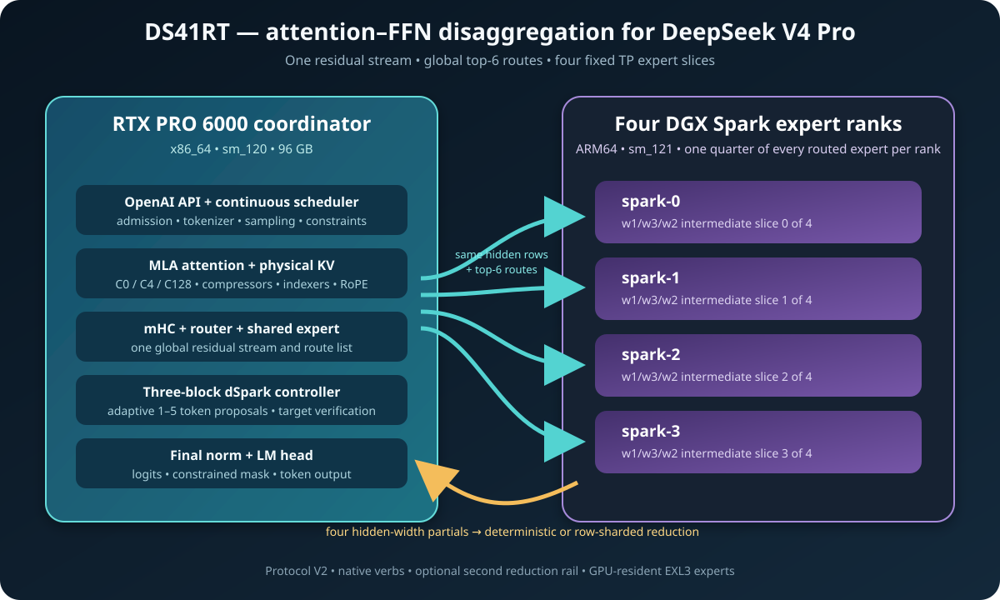
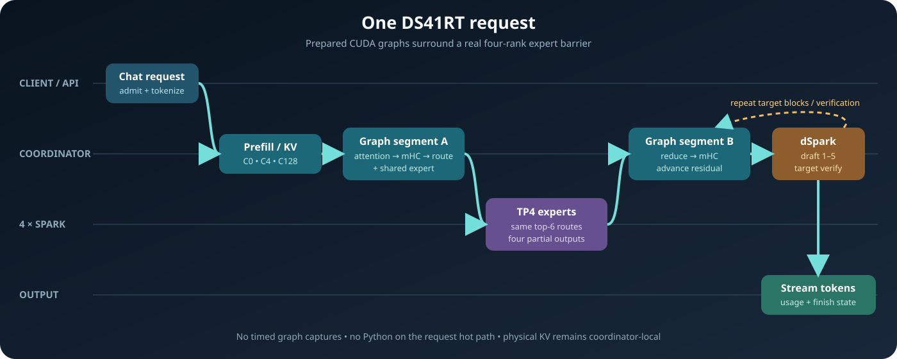
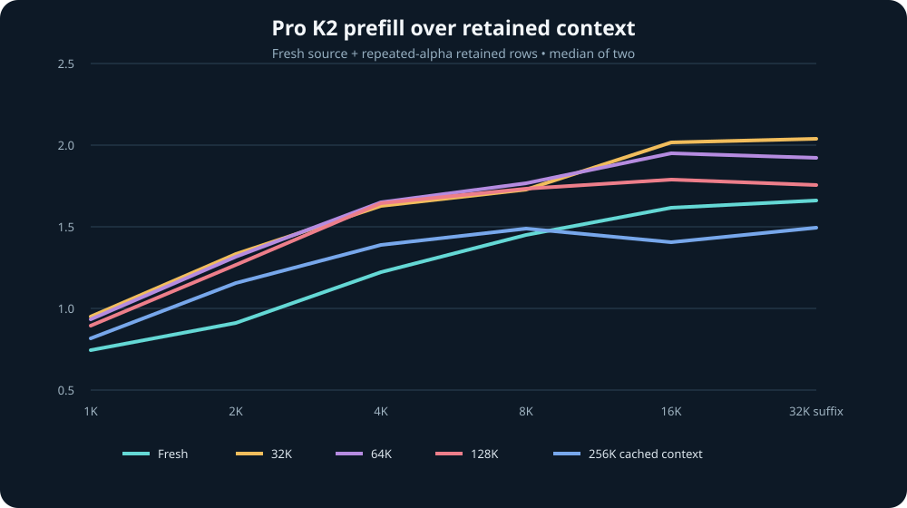
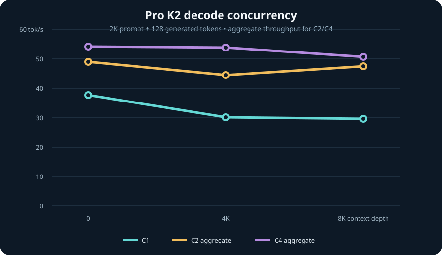

# DS4RT — DeepSeek V4 Pro on one RTX PRO 6000 + four DGX Sparks

## Up to 68 tok/s decode and 2,039 tok/s prefill

Those headline peaks are intentionally transparent stress cases: decode asks
for the word `orchid` exactly 100 times, while retained prefill extends a
repeated-`alpha` prefix and excludes prefix construction. On the fresh
semantic and source-code workloads below, Pro reaches 38.08 tok/s across the
seven-case blend, 52.50 tok/s on its code slice, and 1,663.5 tok/s at fresh
32K prefill.

DS4RT is a Rust/CUDA inference engine built specifically for
DeepSeek V4 Pro 0813 on one NVIDIA RTX PRO 6000 Blackwell 96 GB coordinator
and four NVIDIA DGX Spark expert workers. The coordinator owns attention,
cache, scheduling, sampling, and the OpenAI-compatible API. The Sparks hold
and execute tensor-parallel slices of every routed MoE expert.

The v2 runtime serves the calibrated 2-bpw EXL3 checkpoint
[`wrldsuksgo2mars/DeepSeek-V4-Pro-0813-EXL3-K2-calibrated-v1`](https://huggingface.co/wrldsuksgo2mars/DeepSeek-V4-Pro-0813-EXL3-K2-calibrated-v1).
Model weights are not included in the repository or containers.

## What's new in v2

This minor engine release adds direct serving support for qualified
projection-mixed K2/K3 EXL3 artifacts, makes inline mixed quantization and its
resumable source-native publication flow portable, and refreshes the pinned
GPTQModel and SparkInfer/B12x implementations. The default Pro checkpoint above
is unchanged.

## Why

DeepSeek V4 Pro is too large for this five-machine cluster as an ordinary
replicated or expert-parallel deployment. DS4RT uses attention–FFN
disaggregation and 4-way tensor-parallel routed experts instead: the RTX keeps
the residual stream and model-specific attention state, while each Spark keeps
one quarter of every expert's intermediate dimension. That makes the hardware
layout useful without changing the model's global top-6 routing semantics.

## Architecture

[](docs/architecture.svg)

For each sparse block, the coordinator computes attention, mHC mixing, the
shared expert, and the global routes. The same hidden rows and top-6 routes go
to all four Sparks; their four partial hidden-width results are reduced before
the coordinator advances the residual stream. DeepSeek's three-block dSpark
drafter uses the same expert path.

[](docs/request-path.svg)

The stable ownership, transport, cache, and profile contracts are described in
[`architecture.md`](architecture.md).

## Quick deploy with the v2 images

The checked-in configuration points at immutable `v2` images:

- `ghcr.io/tpurtell/ds4rt-coordinator:v2` (`linux/amd64`, CUDA `sm_120`)
- `ghcr.io/tpurtell/ds4rt-spark-expert:v2` (`linux/arm64`, CUDA `sm_121`)

Clone the complete source graph:

```bash
git clone --recurse-submodules \
  https://github.com/tpurtell/ds4rt-pro-rtx-4spark.git
cd ds4rt-pro-rtx-4spark
```

Edit `ds4rt.config` for the four Spark SSH host names and the dedicated
coordinator-to-Spark addresses. The default names (`ostrich`, `dodo`, `emu`,
and `kiwi`) and `10.55.0.x` addresses are examples from the measured cluster.
If the coordinator has multiple GPUs, keep `COORDINATOR_GPU=0` and optionally
pin that physical device's UUID and PCI address in a site-local config.

The exact Pro snapshot must already exist in the Hugging Face cache on all five
hosts. One way to populate it is:

```bash
MODEL=wrldsuksgo2mars/DeepSeek-V4-Pro-0813-EXL3-K2-calibrated-v1
REVISION=7a63f24905223aff19212d65226be708950823ac

hf download "$MODEL" --revision "$REVISION"
for host in ostrich dodo emu kiwi; do
  ssh "$host" hf download "$MODEL" --revision "$REVISION"
done
```

Pull the role-specific images on their native hosts:

```bash
docker pull ghcr.io/tpurtell/ds4rt-coordinator:v2
for host in ostrich dodo emu kiwi; do
  ssh "$host" docker pull ghcr.io/tpurtell/ds4rt-spark-expert:v2
done
```

Validate the entire deployment without changing it, then launch:

```bash
./run.sh --dry-run
./run.sh
```

Startup can take about a minute even with local NVMe snapshots because DS4RT
loads roughly 438 GB of tensor payload across the workers and prepares the
production CUDA graph set. `run.sh` returns only after all four experts and the
API have passed their readiness gates.

## API

The server exposes an OpenAI-compatible API at
`http://127.0.0.1:8000/v1` by default:

```bash
curl http://127.0.0.1:8000/v1/chat/completions \
  -H 'Content-Type: application/json' \
  -d '{
    "model": "wrldsuksgo2mars/DeepSeek-V4-Pro-0813-EXL3-K2-calibrated-v1",
    "messages": [{"role": "user", "content": "Write a Rust merge sort."}],
    "temperature": 0,
    "max_tokens": 256
  }'
```

Streaming chat completions, reasoning controls, tool calls, JSON object/JSON
Schema output, continuous batching, prefix reuse, and long context are
supported. The `-full` model alias disables dSpark for a plain target-model
control.

Stop the five-container deployment with:

```bash
./stop.sh
```

## Build from source

The supported release build is intentionally native on both architectures.
It builds the coordinator image locally, stages the same source on the first
configured Spark, builds the expert image there, verifies both roles, and
distributes the expert image to the remaining Sparks:

```bash
git submodule update --init --recursive
./build.sh
./run.sh --dry-run
```

The NGC base image, CUDA-capable Docker runtime, SSH access, local model cache,
and at least 60 GiB of free build space are required. See
[`DEVELOPER.md`](DEVELOPER.md) for the build/test ladder and
[`docker/README.md`](docker/README.md) for image internals and publishing.

## Performance

This is the unchanged v1 measurement record; v2 does not republish benchmark
claims. These measurements use the public Pro K2 artifact, the `balanced`
FP8-KV profile, adaptive dSpark, temperature zero, thinking disabled, one RTX
PRO 6000 Blackwell coordinator, and four DGX Spark TP4 workers on the dedicated
400-Gb/s fabric. Rates are end-to-end unless stated otherwise.

| Release gate | Result |
| --- | ---: |
| Artificial repeated-word decode, best of five | **68.09 tok/s** |
| Seven-case semantic blend, 35 generations | **38.08 tok/s** |
| Code slice, five generations | **52.50 tok/s** |
| Artificial retained 32K + 32K prefill, median of two | **2,039.0 tok/s** |
| Fresh source-code 32K prefill, median of two | **1,663.5 tok/s** |
| Fresh source-code 8K prefill, median of two | **1,451.1 tok/s** |
| dSpark draft-token acceptance, semantic blend | **63.98%** |
| Tool Eval Bench 2.3.2, 69 scenarios | **86/100** (118/138 points) |
| Cold startup, coalesced expert reads | **64.75 s** |
| Warm restart, reused expert residency/capture metadata | **60.89–61.31 s** |

The repeated-word decode samples ranged from 66.81 to 68.09 tok/s and produced
exactly 100 `orchid` occurrences every time. The fresh 8K prefill samples were
1,458.9 and 1,443.4 tok/s. Every timed repeat-decode and prefill sample
completed full attention and numeric-progression checks with zero request-time
CUDA graph captures.

The post-attention-fix Tool Eval run completed all 69 scenarios without a
backend failure: 54 passed, 10 were partial, and 5 failed. Its safety gate did
not pass (warnings on TC-34, TC-42, TC-58, and TC-60), so 86/100 is a tool-use
quality result, not a safety qualification.

### Prefill over retained context

Each cell is thousands of newly computed tokens per second and is the median
of two timed requests. The fresh row uses cache-busted source-code prompts.
The retained rows reuse an artificial repeated-`alpha` physical
compressor/KV prefix; prefix construction is excluded.

| Cached context | 1K | 2K | 4K | 8K | 16K | 32K |
| ---: | ---: | ---: | ---: | ---: | ---: | ---: |
| Fresh | 0.75 | 0.91 | 1.22 | 1.45 | 1.62 | 1.66 |
| 32K | 0.95 | 1.33 | 1.63 | 1.73 | 2.01 | 2.04 |
| 64K | 0.94 | 1.32 | 1.65 | 1.77 | 1.95 | 1.92 |
| 128K | 0.89 | 1.27 | 1.64 | 1.74 | 1.79 | 1.76 |
| 256K | 0.82 | 1.15 | 1.39 | 1.49 | 1.41 | 1.49 |



### Decode concurrency

This August 21 rerun uses a 2K prompt, exactly 128 generated tokens, three
timed runs per cell, and context depths of 0, 4K, and 8K. C2/C4 values are
aggregate throughput; all 63 requests completed without an error.

| Context depth | C1 | C2 aggregate | C4 aggregate |
| ---: | ---: | ---: | ---: |
| 0 | 37.6 | 49.0 | 54.2 |
| 4K | 30.2 | 44.6 | 53.8 |
| 8K | 29.7 | 47.5 | 50.6 |



The full measurement contract and machine-readable summary are in
[`benchmarks/README.md`](benchmarks/README.md) and
[`benchmarks/pro-v1.json`](benchmarks/pro-v1.json).

## Scope

DS4RT v2 is a hardware-specific engine, not a general-purpose serving
framework. Its release topology is exactly one x86_64 `sm_120` coordinator and
four ARM64 `sm_121` expert workers. Adapting GPU generations, worker count,
transport, or model family is engineering work, not a configuration switch.

DS4RT is released under the [MIT License](LICENSE). Redistributed components
retain their own terms; see [`THIRD_PARTY_NOTICES.md`](THIRD_PARTY_NOTICES.md)
and [`third_party/README.md`](third_party/README.md).
