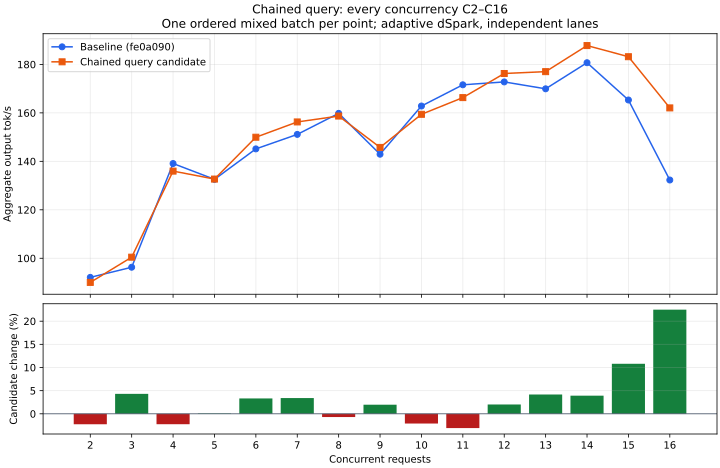

# Chained-query concurrency curve

Follow-up requested after the initial three C16 losses. This compares the same
frozen baseline (`fe0a090`) and chained-query binaries at every integer
concurrency from C2 through C16. Artifact hashes match the original experiment.
One ordered mixed batch per point and arm; adaptive dSpark, independent lanes,
five RTX expert layers, unchanged KV budget, RTX 400 W, standard memory speed.
No builds overlapped inference. Both sweeps finished and standard serving was
restored. Lifecycle checks were not repeated for this diagnostic sweep.

| C | Baseline tok/s | Chained query tok/s | Change | Peak overlap (before/after) |
| --- | ---: | ---: | ---: | ---: |
| 2 | 92.14 | 90.06 | -2.3% | 2/2 |
| 3 | 96.32 | 100.46 | +4.3% | 3/3 |
| 4 | 139.10 | 135.98 | -2.2% | 4/4 |
| 5 | 132.57 | 132.69 | +0.1% | 5/5 |
| 6 | 145.14 | 149.96 | +3.3% | 6/6 |
| 7 | 151.12 | 156.26 | +3.4% | 7/7 |
| 8 | 159.81 | 158.69 | -0.7% | 8/8 |
| 9 | 142.94 | 145.75 | +2.0% | 9/9 |
| 10 | 162.83 | 159.41 | -2.1% | 10/10 |
| 11 | 171.59 | 166.30 | -3.1% | 11/11 |
| 12 | 172.77 | 176.25 | +2.0% | 12/12 |
| 13 | 169.93 | 177.01 | +4.2% | 13/13 |
| 14 | 180.70 | 187.77 | +3.9% | 14/14 |
| 15 | 165.32 | 183.17 | +10.8% | 15/15 |
| 16 | 132.30 | 162.05 | +22.5% | 16/16 |

The curve does **not** show a consistent C16 cliff. Differences through C14
range from −3.1% to +4.3%, followed by larger gains at C15/C16. All points reach
their requested overlap. C16 emits 3,059 versus 3,088 total tokens, with the
measured first-content-to-last-finish span falling from 23.00 to 18.96 seconds.
This is not simply a proportional change in output token count; output content,
adaptive work and completion tails still differ.

This does not overturn the observations in the [earlier three pairs](phase1-chained-query.md),
but it limits their interpretation: they are not proof of a general C16
regression. The baseline C16 rate in this sweep is substantially lower than all
three earlier controls. Adding intermediate batches changes nonce consumption,
graph warmup and cache history. This sweep does not isolate which factor caused
the reversal, and a single observation per point is not a statistical estimate
of expected improvement. There is no smoothing or fitted scaling law in the plot.

The candidate remains archived pending integration with the remaining blocking
work. Its rejection was an initial workload-specific promotion decision, not a
reason to abandon cooperative query completion. Preserve both sets of evidence.

[Machine-readable data and commands](phase1-chained-query-curve.json).
Raw reports, monitor logs and plotting script:
`/home/tj/.cache/ds41rt-experiments/chained-query`.
