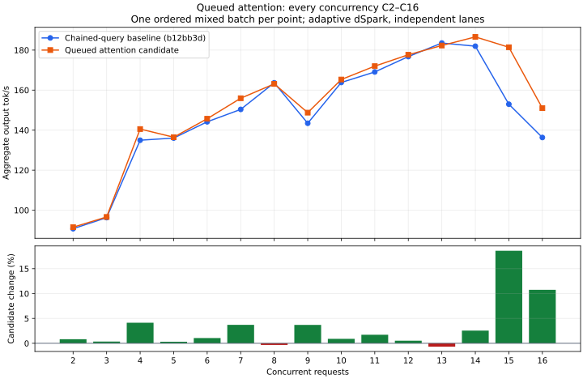

# Queued-attention concurrency curve

Same frozen artifacts as the [initial comparison](phase1-queued-attention.md),
with candidate first and baseline second. One ordered mixed batch per integer
C2–C16. Adaptive dSpark, independent lanes, five RTX resident layers, unchanged
KV budget, RTX 400 W and standard memory speed. No builds overlap inference.
Both arms finished and the standard service was restored.

| C | Baseline tok/s | Queued attention tok/s | Change | Peak overlap (before/after) |
| --- | ---: | ---: | ---: | ---: |
| 2 | 90.76 | 91.51 | +0.8% | 2/2 |
| 3 | 96.30 | 96.64 | +0.3% | 3/3 |
| 4 | 134.96 | 140.55 | +4.1% | 4/4 |
| 5 | 136.05 | 136.47 | +0.3% | 5/5 |
| 6 | 144.18 | 145.70 | +1.1% | 6/6 |
| 7 | 150.37 | 155.94 | +3.7% | 7/7 |
| 8 | 163.65 | 163.11 | -0.3% | 8/8 |
| 9 | 143.44 | 148.74 | +3.7% | 9/9 |
| 10 | 163.82 | 165.29 | +0.9% | 10/10 |
| 11 | 169.08 | 171.98 | +1.7% | 11/11 |
| 12 | 176.75 | 177.67 | +0.5% | 12/12 |
| 13 | 183.53 | 182.28 | -0.7% | 13/13 |
| 14 | 181.94 | 186.59 | +2.6% | 14/14 |
| 15 | 152.96 | 181.42 | +18.6% | 15/15 |
| 16 | 136.33 | 150.99 | +10.8% | 16/16 |

C2–C14 range from −0.7% to +4.1%; the larger C15/C16 differences remain
workload/history-sensitive single observations. Each point reaches its requested
request overlap. Intermediate batches change nonce consumption and graph/cache
history relative to the initial sparse sweep. Do not pool these observations as
repeats or claim a universal gain.

The initial C16 result was 175.53 → 140.43 tok/s. Its completion tail was strongly
influenced by a longer prose response; the initial report preserves an offline
sensitivity calculation alongside the unmodified score. This broader sweep
reverses the C16 direction (136.33 → 150.99). Neither result establishes the
cause of output differences. The full evidence supports retaining cooperative
attention while completing the remaining blocking path.

[Data, commands and artifact hashes](phase1-queued-attention-curve.json).
Raw runs and plotting script: `/home/tj/.cache/ds41rt-experiments/queued-attention`.
