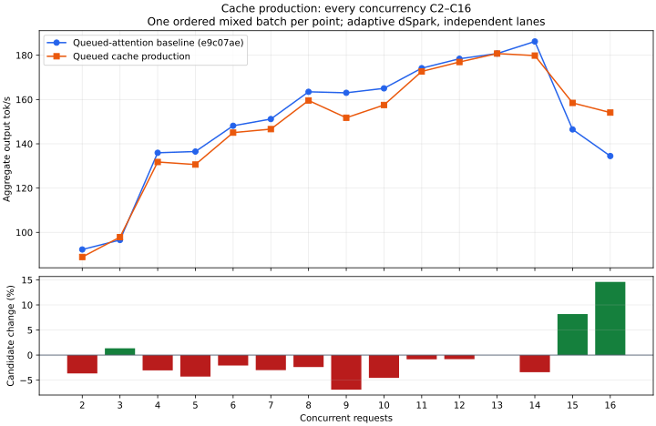

# Queued cache production: development checkpoint

This change removes host-blocking completion of window and compressed-source
production from independent decode. Transfers use existing pinned staging and
producer streams. Cold graph warmup and replay complete through polling; graph
capture itself never suspends. Only completed work publishes a proposal.
`PendingProduction` retains the execution owner, drains cancellation/error paths,
and checks the batch/layer before the completed proposals are consumed. Shared
cache borrows end before the scheduler yields. No GPU allocations are added.

The GPU fixture compares direct and queued outputs for 21 window layers and all
four compressed sources, including cold/warm graphs and unpolled cancellation
followed by reuse. It passes, along with existing incomplete-pass revocation,
reserved encoder and paired encoder checks. Serving checks pass for needle,
prompt reuse, retained turns, cancellation/survivors/recovery and high-thinking
constraints. Three C1 code repeats match exactly; median throughput is
130.18 → 128.89 tok/s. Test and release builds pass.

## Performance remains unresolved

The complete C2–C16 sweep uses one ordered mixed batch per point, baseline then
candidate, on the same official weights, five RTX resident layers, KV budget,
400 W power limit and standard memory speed. No builds overlap inference.
Startup readiness is 5.319 → 5.312 seconds; observed peak GPU memory is
97,002 → 96,982 MiB.

| C | Baseline tok/s | Queued cache tok/s | Change | Peak overlap (before/after) |
| --- | ---: | ---: | ---: | ---: |
| 2 | 92.27 | 88.88 | -3.7% | 2/2 |
| 3 | 96.56 | 97.86 | +1.3% | 3/3 |
| 4 | 135.95 | 131.79 | -3.1% | 4/4 |
| 5 | 136.50 | 130.64 | -4.3% | 5/5 |
| 6 | 148.14 | 145.05 | -2.1% | 6/6 |
| 7 | 151.18 | 146.63 | -3.0% | 7/7 |
| 8 | 163.49 | 159.57 | -2.4% | 8/8 |
| 9 | 163.03 | 151.77 | -6.9% | 9/9 |
| 10 | 165.04 | 157.52 | -4.6% | 10/10 |
| 11 | 174.16 | 172.68 | -0.9% | 11/11 |
| 12 | 178.40 | 176.94 | -0.8% | 12/12 |
| 13 | 180.76 | 180.76 | +0.0% | 13/13 |
| 14 | 186.21 | 179.84 | -3.4% | 14/14 |
| 15 | 146.49 | 158.47 | +8.2% | 15/15 |
| 16 | 134.48 | 154.11 | +14.6% | 16/16 |

Across C2–C14, the median relative change is **−3.0%**. Positive C15/C16 points
are workload/history-sensitive and do not cancel the lower rates at most other
points. Treat this as an unresolved implementation cost, not established random
noise or a release-qualified optimization. It is committed as partial progress
toward the required asynchronous loop.

Next investigate a common GPU submission/completion boundary for producer and
index work. Index query copies, projection and selection still block after the
producer wait. Reducing those boundaries may improve the combined path; that is
a hypothesis requiring measurement, not an explanation already demonstrated.
Keep the frozen **e9c07ae** baseline for the combined comparison, so successive
partial changes cannot hide cumulative regression.

[Full initial evidence](phase1-queued-cache-production.json) and
[curve data/commands](phase1-queued-cache-production-curve.json).
Both arms finished, and standard serving was restored.
