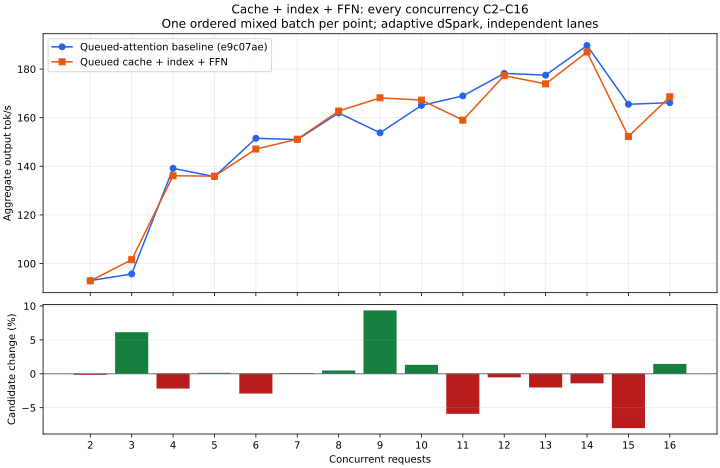

# Cooperative router, shared FFN and local experts

Independent decode now waits cooperatively for router exports, shared FFN
execution and local routed experts. The direct path remains available for C1
and prefill. The shared-input copy is queued on its existing stream. Router
exports retain the existing compact local IDs and full remote request layout.
There are no additional device allocations or streams and no kernel/math changes.

Cold router/shared warmup and replay both complete cooperatively. Capture itself
never suspends. The future retains each component and its inputs; the stream wait
owns a cancellation guard that drains before buffers or pinned staging can be
reused. Outputs publish only after completion. Local experts use the same kernels,
capacity selection and shared scratch, exclusively owned through the wait.

Real-weight GPU checks pass exact router/shared comparisons across 37 layers,
with both router export modes, cold/warm graphs and 112 observed pending
cancellations followed by reuse. Layer-0 local routed output also matches the
direct implementation exactly. The existing cache/index, revocation, encoder and
paired-encoder fixture checks pass. The CPU FFN cancellation/publication check,
test build and release build pass.

Router/shared/local completion is one part of the asynchronous-loop work.
Final mHC, layer advance, Engram gates, dSpark taps and cold sparse setup remain
listed in the [wait audit](phase1-lane-wait-audit.md).

## Accumulated performance comparison

The control remains frozen **e9c07ae**, before producer/index/FFN changes.
Both arms use adaptive dSpark with independent decisions, five RTX layers,
the same KV budget, a 400 W power limit and standard memory speed. Builds did
not overlap inference. One ordered batch per integer C2–C16 is exploratory
coverage, not repeated release qualification.

Three C1 code outputs match exactly; median throughput is **130.18 → 129.98 tok/s
(−0.15%)**. The median relative change across C2–C14 is **−0.14%**. C16 is
**166.16 → 168.58 (+1.5%)**, but C11 is −5.9% and C15 is −8.0%. The earlier
combined producer/index C16 loss does not recur in this pair; that does not prove
the FFN change caused its recovery. Keep all earlier results and the preserved
control rather than claiming a uniform speedup or dismissing lower points.

| C | Baseline tok/s | Queued cache/index/FFN tok/s | Change |
| --- | ---: | ---: | ---: |
| 2 | 93.00 | 92.87 | -0.1% |
| 3 | 95.71 | 101.58 | +6.1% |
| 4 | 139.14 | 136.11 | -2.2% |
| 5 | 135.76 | 135.95 | +0.1% |
| 6 | 151.51 | 147.09 | -2.9% |
| 7 | 150.98 | 151.15 | +0.1% |
| 8 | 161.94 | 162.73 | +0.5% |
| 9 | 153.78 | 168.15 | +9.3% |
| 10 | 165.04 | 167.22 | +1.3% |
| 11 | 168.96 | 158.99 | -5.9% |
| 12 | 178.22 | 177.28 | -0.5% |
| 13 | 177.48 | 173.89 | -2.0% |
| 14 | 189.68 | 187.00 | -1.4% |
| 15 | 165.50 | 152.25 | -8.0% |
| 16 | 166.16 | 168.58 | +1.5% |

Actual peak overlap equals requested concurrency at all points. HTTP readiness
is 5.311 → 5.322 seconds; observed peak GPU memory is 96,946 → 96,982 MiB.
Needle, prompt reuse, retained turns, cancellation/survivors/recovery, four
high-thinking constraint checks and two concurrent long-context counting
responses all pass in both arms. Standard serving was restored.

Retain this as implementation progress toward the asynchronous loop. The final
release comparison remains pending after the remaining waits and candidate
revisits. Existing README/report release scores are unchanged.

[Curve, commands and mixed results](phase1-queued-ffn-curve.json),
[code, functional and artifact evidence](phase1-queued-ffn.json).
