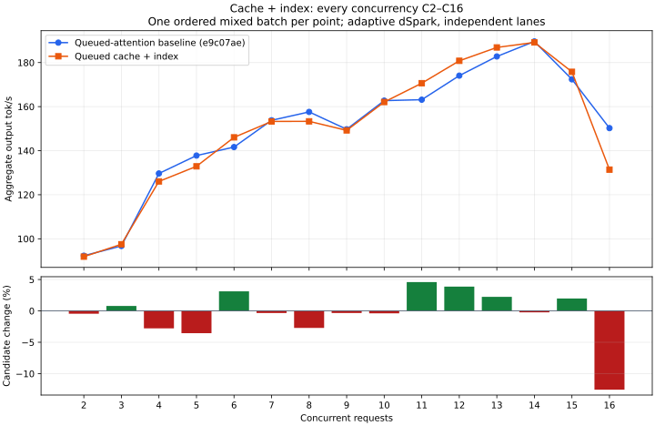

# Queued cache and index: development checkpoint

Index projection now overlaps cache production. Once both producers are ready,
index selection completes through polling before attention consumes its output.
Pending ownership retains query, selection and cache buffers; cancellation drains
consumers before producers. Cold warmup completes cooperatively, with no suspension
inside graph capture. This adds no GPU allocation and preserves index math.

The real-weight GPU fixture passes exact direct/queued comparisons for 37 window
layers, four compressed sources and eight index layers, including retained source-20
candidates, cold/warm graphs, cancellation and reuse. Existing encoder/revocation
checks pass. Serving lifecycle, four high-thinking constraint checks, and two
concurrent 16K-context counting responses with prompt reuse pass in both arms.
Test and release builds pass. Three C1 code responses match exactly.

## Performance remains unresolved

The control is frozen **e9c07ae**, before either the producer or index change.
One ordered mixed batch per integer C2–C16 was run, baseline then candidate,
with adaptive dSpark, independent lanes, five RTX layers, the same KV budget,
400 W limit and standard memory speed. Builds did not overlap inference.
This is exploratory evidence, not repeated release qualification.

C1 median is **130.18 → 128.43 tok/s (−1.3%)**. Across C2–C14 the median
relative change is **−0.34%**, compared with −3.0% in the separate producer-only
experiment. These are different runs, so that comparison does not isolate the
index change's causal benefit. C16 declines **150.25 → 131.40 tok/s (−12.5%)**.
Several C16 requests take longer, including identical code outputs; this is not
a demonstrated single-output-tail explanation. Keep this cost unresolved.

| C | Baseline tok/s | Queued cache/index tok/s | Change |
| --- | ---: | ---: | ---: |
| 2 | 92.31 | 91.89 | -0.5% |
| 3 | 96.75 | 97.51 | +0.8% |
| 4 | 129.66 | 126.05 | -2.8% |
| 5 | 137.78 | 132.89 | -3.6% |
| 6 | 141.64 | 146.06 | +3.1% |
| 7 | 153.80 | 153.28 | -0.3% |
| 8 | 157.60 | 153.32 | -2.7% |
| 9 | 149.72 | 149.22 | -0.3% |
| 10 | 162.72 | 162.10 | -0.4% |
| 11 | 163.15 | 170.64 | +4.6% |
| 12 | 174.08 | 180.81 | +3.9% |
| 13 | 182.79 | 186.88 | +2.2% |
| 14 | 189.59 | 189.16 | -0.2% |
| 15 | 172.40 | 175.80 | +2.0% |
| 16 | 150.25 | 131.40 | -12.5% |

Actual peak overlap equals requested concurrency at every point in both arms.
HTTP readiness is 5.319 → 5.306 seconds; observed peak memory is
96,944 → 96,982 MiB. Standard serving was restored.

Retain this as partial implementation progress. Preserve the e9c07ae control
through the remaining router/shared/local-FFN and layer-completion work, and
investigate C1/C16 costs before release qualification. No README release scores
are replaced by these exploratory measurements.

[Curve and raw mixed results](phase1-queued-index-curve.json),
[functional, code and artifact evidence](phase1-queued-index.json).
