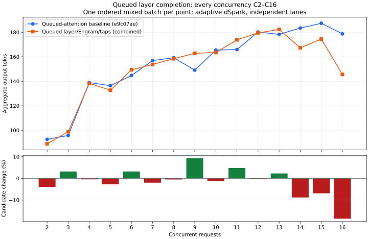

# Cooperative layer completion, Engram and dSpark taps

Independent decode queues final FFN mHC and the next layer's residual/pre copies
on one existing stream, then waits cooperatively once. The completed output
remains available for tracing or encoder retention. Layer advance installs the
next bindings and skips copies already completed in this chain. Layer 39 omits
the next-input copies. Direct execution remains available for C1/prefill.

Engram I/O polling now returns an owned gather lease outside the shared request
borrow. Upload copies through pinned staging, then dequantizes cooperatively.
Gate staging, cold warmup, graph replay and the final residual copy also complete
cooperatively; capture itself never suspends. The block publishes prepared input
only after the residual is ready. Both upload and gate drain cancellation before
reuse. The two full-capacity upload owners add **51,912,704 bytes (49.51 MiB)**
of pinned host staging, with no additional GPU allocation or stream.

The three dSpark taps retain prepared inputs through cooperative completion
before the next query can overwrite them. Tap order and batch identity checks
remain unchanged.

The real-weight fixture passes exact direct/cooperative mHC and next-input
comparisons across 37 layers, with 37 observed pending cancellations and reuse.
Both Engram uploads match dequantized embeddings/masks exactly; both gates match
the direct residual output with cold/warm graphs and pending cancellation/reuse.
Previous router/shared/local, cache/index, revocation and encoder checks pass.
The CPU tap order/batch check, test build and release build also pass.

The fixture's partial backbone pass stops at layer 36 to retain its incomplete
commit check; full serving checks cover complete passes and taps. Remaining
cold sparse setup and rebind/eviction audit are tracked in the
[wait audit](phase1-lane-wait-audit.md). This is not release qualification.

## High-concurrency performance remains unresolved

Control is frozen **e9c07ae**, before producer/index/FFN/layer changes. This
compares the accumulated implementation, not an isolated estimate of the latest
change. Both arms use adaptive dSpark with independent decisions, five RTX layers,
the same KV budget, a 400 W limit and standard memory speed. Builds did not overlap
inference. One ordered mixed batch per integer C2–C16 provides exploratory coverage.

Three C1 code outputs match exactly; median throughput is **130.17 → 129.63 tok/s
(−0.41%)**. The median relative change across C2–C14 is **−0.46%**. However,
C14 falls **8.8%**, C15 **6.9%**, and C16 **18.5% (178.70 → 145.56 tok/s)**.
Several identical C16 code responses also take longer: request 0 is
8.971 → 11.174 seconds, request 3 is 8.775 → 10.626, and request 6 is
8.730 → 9.651. Response-length changes alone do not explain the loss.

| C | Baseline tok/s | Queued layer/Engram/taps tok/s | Change |
| --- | ---: | ---: | ---: |
| 2 | 92.55 | 88.92 | -3.9% |
| 3 | 95.75 | 98.79 | +3.2% |
| 4 | 138.94 | 138.30 | -0.5% |
| 5 | 136.40 | 132.68 | -2.7% |
| 6 | 144.75 | 149.35 | +3.2% |
| 7 | 156.85 | 153.73 | -2.0% |
| 8 | 159.24 | 158.42 | -0.5% |
| 9 | 149.08 | 162.84 | +9.2% |
| 10 | 165.47 | 163.48 | -1.2% |
| 11 | 165.87 | 173.84 | +4.8% |
| 12 | 180.21 | 179.47 | -0.4% |
| 13 | 178.28 | 182.33 | +2.3% |
| 14 | 183.41 | 167.27 | -8.8% |
| 15 | 187.36 | 174.47 | -6.9% |
| 16 | 178.70 | 145.56 | -18.5% |

Actual peak overlap matches requested concurrency in both arms at every point.
Keep the high-concurrency loss unresolved, with the original control and all
previous curves intact. Removing waits is required architectural progress, but
this result is not a release-qualified performance improvement. Finish cold
sparse setup and investigate the accumulated high-concurrency cost before release.

Needle, prompt reuse, retained turns, cancellation/survivors/recovery, four
high-thinking constraint checks and concurrent 16K-context counting all pass in
both arms. Observed peak GPU memory is 97,004 → 97,002 MiB. Container start to
API-ready log timestamps are **5.289 → 5.052 seconds**; HTTP polling instead
reports 6.329 → 5.316 seconds, so the apparent full second is polling granularity.
Standard serving was restored. Existing README/report release tables are unchanged.

[Curve and full mixed evidence](phase1-queued-layer-curve.json),
[functional, code, startup and artifact evidence](phase1-queued-layer.json).
