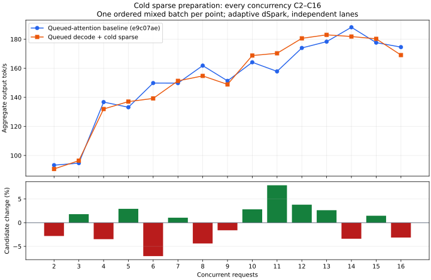

# Cooperative cold attention and explicit completed-owner checks

Cold sparse attention now owns its launch description while GPU warmup completes
cooperatively. After warmup, graph capture runs without suspension, then attention
and its projection/mHC consumers queue on the same stream. Warm graph hits keep
the existing combined submission. A lane guard is installed before submission;
errors, cancellation and unwinding drain before cache/query/selection or consumer
storage can be reused. No device allocation or stream is added.

Query, index-query, projection, router, shared-FFN and mHC rebinds now require an
already-complete stream using a nonblocking query. Router mode switches and
cooperative cache/index/Engram graph eviction use the same explicit check.
Direct cache execution retains its necessary staged-copy drain. Error cleanup,
destruction and admission/prefill still drain when ownership requires it.

The real-weight fixture passes at both 80 rows and 32 descriptor-batched rows.
Cold warmup is observed in both paths, including cancellation before completion
and subsequent reuse. Eight saved layer-0/1 output files match the prior checkpoint
exactly at 80 rows. Cache/index, mHC/next-input, router/shared/local and both Engram
checks also pass, with incomplete-commit revocation and sequential/paired encoder
checks preserved. Test and release builds pass.

Projection and LM-head cold warmup now also yield while the GPU works; capture
runs synchronously after warmup completion. Projection queues on the attention
stream, and the pending lane owner retains its inputs through projection and
FFN preparation. Both fixture sizes pass again after this change: all 16 saved
outputs match the initial cold-sparse candidate exactly. Three C1 code checks,
four high-thinking constraint checks and concurrent 16K indexed-context counting
pass. The standard serving container is restored after each experiment.

## Exploratory curve before the projection/head follow-up

This curve compares frozen e9c07ae against the accumulated cold-sparse/rebind
candidate, **before** the projection/head follow-up. It is one ordered batch per
C2–C16, not repeated release qualification. Both arms use five RTX layers, adaptive
independent dSpark, the normal KV pool, a 400 W cap and standard memory speed.
Builds do not overlap inference. Peak overlap matches every requested concurrency.

C1 code median is 129.86 → 129.37 tok/s (−0.37%), with exact outputs. Median
relative change across C2–C14 is +1.05%; C16 is 174.55 → 169.08 tok/s (−3.1%).
The previous 18.5% C16 loss does not recur in this pair, but that does not erase
its evidence or establish performance equivalence. C6 is still −7.1% in this
sweep. All six C16 code responses match; five finish sooner, one later.

| C | Control tok/s | Cold sparse/rebind tok/s | Change |
| --- | ---: | ---: | ---: |
| 2 | 93.36 | 90.74 | -2.8% |
| 3 | 94.74 | 96.44 | +1.8% |
| 4 | 136.74 | 131.98 | -3.5% |
| 5 | 133.18 | 137.07 | +2.9% |
| 6 | 149.83 | 139.25 | -7.1% |
| 7 | 149.78 | 151.35 | +1.1% |
| 8 | 161.83 | 154.74 | -4.4% |
| 9 | 151.33 | 148.91 | -1.6% |
| 10 | 164.12 | 168.75 | +2.8% |
| 11 | 157.85 | 170.31 | +7.9% |
| 12 | 173.98 | 180.58 | +3.8% |
| 13 | 178.31 | 183.00 | +2.6% |
| 14 | 188.21 | 181.83 | -3.4% |
| 15 | 177.63 | 180.23 | +1.5% |
| 16 | 174.55 | 169.08 | -3.1% |

Needle, prompt reuse, retained turns, cancellation/survivors/recovery, constraints
and indexed-context checks pass in both arms. Peak GPU memory is 97,006 → 96,984
MiB. The final projection/head candidate has focused C1 measurements of 119.94,
129.88 and 129.43 tok/s (median 129.43); this is an unpaired follow-up, **not** a
new full curve. The slower first sample is retained without an assigned cause.

## Dynamic CUDA audit

Nsight captures begin after all 16 mixed requests emit content. The first four
seconds end before any request finishes in all three runs (earliest finish is
7.39–7.79 seconds after the capture request). Each profiled server uses a matched
14 GiB KV pool to reserve profiler headroom, with the same five RTX layers and
native library. These are API wall-time observations under instrumentation,
not throughput measurements or a direct estimate of recovered decode time.

| First four seconds | e9c07ae control | Cold sparse/rebind | Plus projection/head |
| --- | ---: | ---: | ---: |
| Stream-synchronize calls | 37,046 | 5,174 | 3,404 |
| Time in stream-synchronize APIs | 981.48 ms | 354.38 ms | 100.94 ms |
| Longest stream-synchronize call | 4.10 ms | 3.54 ms | 2.47 ms |
| Synchronous memcpy calls | 5,270 | 423 | 432 |
| Time in synchronous memcpy APIs | 24.87 ms | 2.75 ms | 2.78 ms |
| Graph instantiation calls | 5,858 | 6,897 | 5,733 |
| Time in graph instantiation APIs | 225.91 ms | 305.29 ms | 252.98 ms |

The loop is still unfinished. Source inspection confirms blocking draft token,
RNG/temperature and stage descriptor uploads, plus cold draft-chain warmup.
Those are next; they do not yet account for every remaining synchronization call.
Frequent graph creation also warrants investigation after GPU waits are removed.
No claim of causality or performance improvement follows from its count alone.

[Curve and mixed evidence](phase1-queued-sparse-curve.json),
[fixture, focused serving and CUDA API evidence](phase1-queued-sparse.json).
Raw traces and scripts remain under
`/home/tj/.cache/ds41rt-experiments/queued-sparse` and `queued-projection`.
The README and performance report remain the qualified release measurements.
