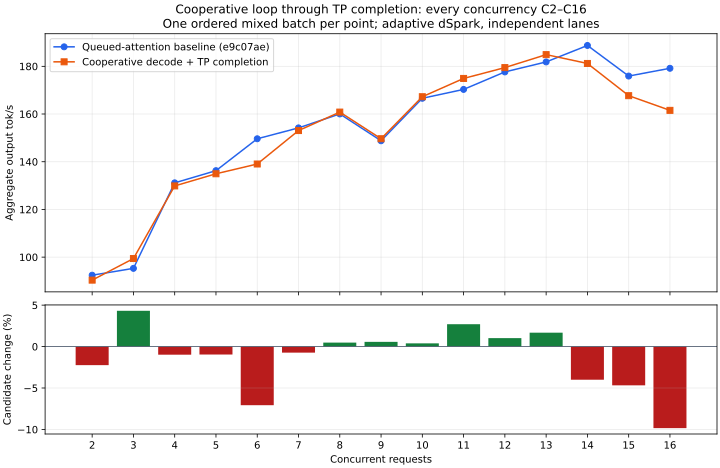

# Cooperative Spark return-path completion

The active-decode call-stack audit located two residual host-thread waits:
`NativeTp4Wave::dispatch_ffn` drained its already-completed stream before sending
new work, and `NativePendingFfn::finish` blocked while reducing the four returned
Spark planes with the shared expert contribution.

Dispatch now requires a completed stream through a nonblocking query. Independent
lanes queue the existing reduction kernel and wait cooperatively, retaining all
received frames, device planes, output and shared input through completion or a
cancellation drain. Successful completion releases receive frames only after the
GPU is done. The direct C1 reduction path remains available. No allocation,
stream, kernel or floating-point operation is added.

Exact reduction checks pass at 1, 6, 80, 81, 256, 1024, 4096 and 6 rows. Pending
cancellation is observed at every size except 1, and subsequent reuse matches the
synchronous reference. Live four-Spark tests pass retained pinned uploads, exact
device copies, injected failure, connection reset, drained release and recovery
at the same sizes. Test and release builds pass; serving is restored after checks.

## Dynamic CUDA audit

The 12-second Nsight capture begins after all 16 mixed requests emit content.
The first finish occurs 7.10 seconds after the capture request, leaving the first
six seconds at full concurrency. The matched profiler configuration uses a
14 GiB KV pool for headroom and five RTX layers; it is not a throughput benchmark.

There are **zero stream/device synchronization calls, synchronous memcpy calls,
CUDA allocations or CUDA frees** in the first four seconds, first six seconds,
and entire 12-second capture. The later portion includes request completions and
changing batch sizes. This verifies removal of the calls observed in this workload;
admission/prefill and failure/shutdown cleanup retain their explicit drains.

| First four seconds | Queued draft checkpoint | Queued TP completion |
| --- | ---: | ---: |
| Stream-synchronize calls | 3,448 | 0 |
| Stream-synchronize API time | 82.35 ms | 0 ms |
| Synchronous memcpy calls | 0 | 0 |
| Graph instantiation calls | 6,311 | 6,339 |
| Graph instantiation API time | 275.18 ms | 288.87 ms |

Graph creation remains substantial synchronous CPU/driver work; its API time
alone does not establish a throughput penalty or justify a particular change.
The next archived experiment combines attention, projection and mHC in a graph.
It must preserve cooperative cold warmup and ownership rather than restore the
old blocking implementation.

[Reduction and CUDA API evidence](phase1-queued-tp.json).
Raw evidence: `/home/tj/.cache/ds41rt-experiments/queued-tp`.

## Accumulated performance comparison

Fresh paired processes compare frozen e9c07ae with this full cooperative-loop
checkpoint: adaptive independent dSpark, five RTX layers, the normal KV pool,
400 W limit and standard memory speed. One ordered batch at every integer C2–C16
is exploratory coverage, not repeated release qualification.

C1 code median is **129.77 → 129.48 tok/s
(-0.22%)**, with all three responses exact. Median relative
change across C2–C14 is **+0.39%**.

C6 falls 7.1% and C16 falls **9.8% (179.17 → 161.54 tok/s)**. C6 was also
7.1% lower in the cold-sparse pair, so this repeated weak point deserves follow-up.
All three identical C16 code responses finish sooner (requests 3/6/12:
9.905 → 9.589, 9.547 → 9.044, 8.589 → 8.073 seconds). Most prose requests finish
later, including some with fewer output tokens. Response-length variation alone
is therefore not a sufficient explanation. High-concurrency performance remains
unresolved before release; preserve the control for the graph revisit.

| C | Control tok/s | Cooperative loop tok/s | Change |
| --- | ---: | ---: | ---: |
| 2 | 92.44 | 90.37 | -2.2% |
| 3 | 95.30 | 99.41 | +4.3% |
| 4 | 131.15 | 129.87 | -1.0% |
| 5 | 136.26 | 134.96 | -1.0% |
| 6 | 149.63 | 139.05 | -7.1% |
| 7 | 154.19 | 153.07 | -0.7% |
| 8 | 160.04 | 160.81 | +0.5% |
| 9 | 148.79 | 149.64 | +0.6% |
| 10 | 166.61 | 167.26 | +0.4% |
| 11 | 170.32 | 174.92 | +2.7% |
| 12 | 177.65 | 179.47 | +1.0% |
| 13 | 181.85 | 184.90 | +1.7% |
| 14 | 188.75 | 181.20 | -4.0% |
| 15 | 175.92 | 167.69 | -4.7% |
| 16 | 179.17 | 161.54 | -9.8% |

Needle, prompt reuse, retained turns, cancellation/survivors/recovery, four
high-thinking constraint checks and concurrent indexed-context counting pass
in both arms. Peak GPU memory is 96982 → 96984 MiB. Container start
to API-ready log time is 5.158 → 5.084 seconds. Standard serving
is restored. These results retain earlier controls and regressions; zero blocking
CUDA calls does not imply a uniform throughput gain.

[Full mixed curve and observations](phase1-queued-tp-curve.json).
